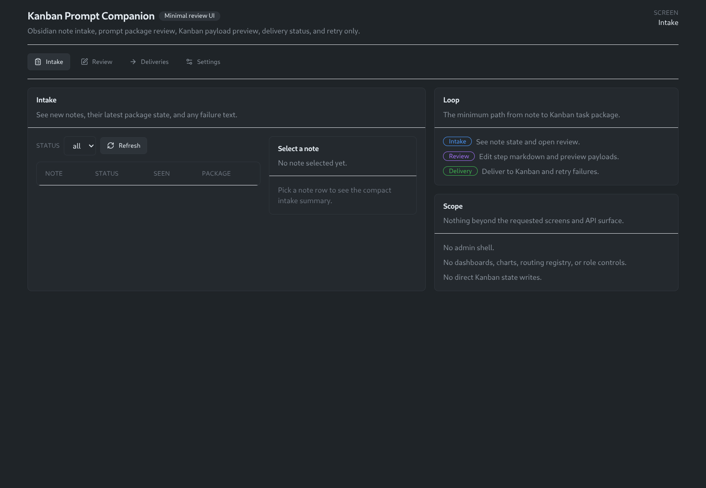
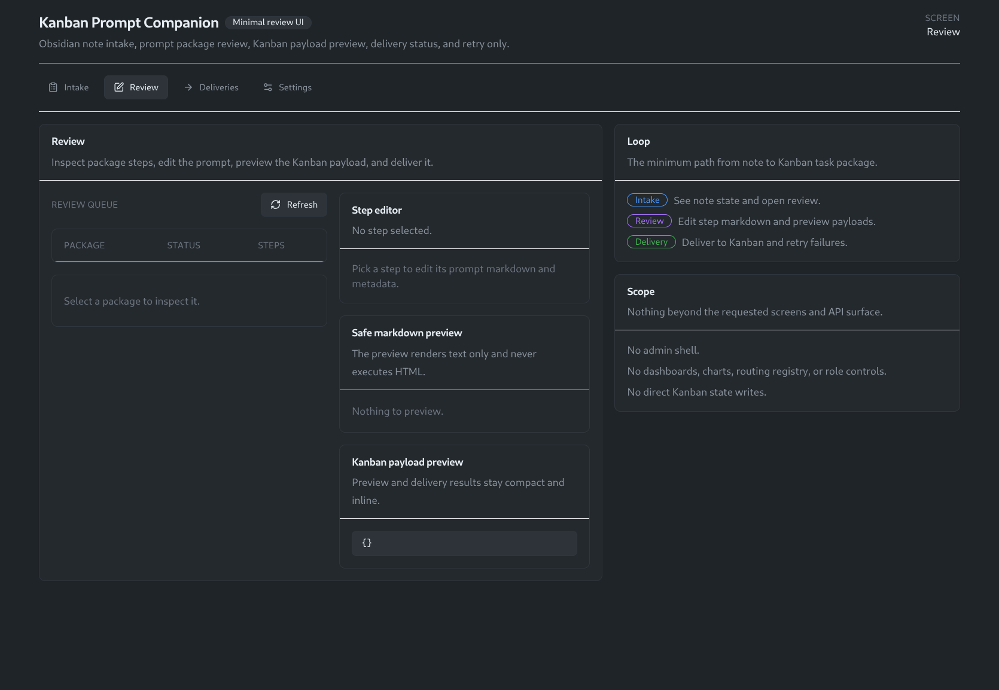
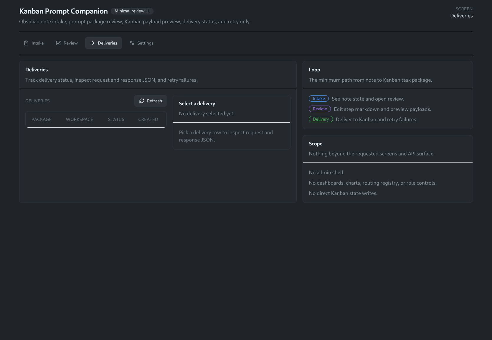
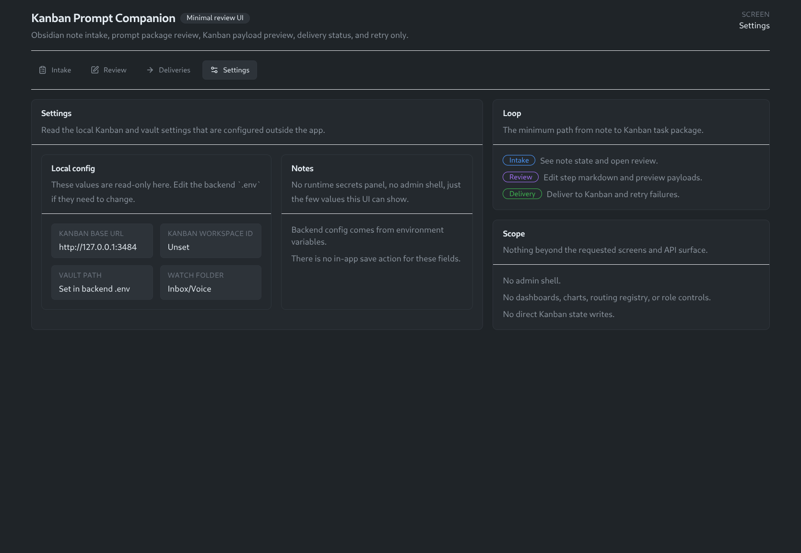

# Kanban Prompt Companion

Kanban Prompt Companion is a focused local app that turns Obsidian voice-note markdown into reviewed Kanban-ready task chains.

Flow:

`Obsidian note -> cleaned intent -> prompt package -> human review -> Kanban delivery`

This repo stays intentionally small. It is not a full PromptForge platform clone.

## Screenshots

### Intake


### Review


### Deliveries


### Settings


## Features

- Watches a vault folder for markdown voice notes
- Extracts and cleans note intent into a versioned prompt package
- Human-in-the-loop review/edit step before delivery
- Kanban preview + delivery through supported API surface
- Delivery history and retry flow

## Architecture

- Backend: FastAPI + SQLite
- Frontend: React + Vite + Tailwind
- Delivery target: Kanban integration endpoints (no direct board file writes)

## Prerequisite: Forked Kanban Build

This companion supports both:

- stock Kanban instances
- custom/forked Kanban instances with extended endpoints

When available, it uses the integration endpoints below:

- `projects.list`
- `projects.add`
- `workspace.getState`
- `workspace.importTasks`
- `workspace.upsertTaskByExternalKey` (when available in your Kanban fork)

Delivery behavior is capability-aware:

1. For single-step packages, it prefers `workspace.upsertTaskByExternalKey` when supported.
2. Otherwise it uses `workspace.importTasks`.
3. If `workspace.importTasks` is not present on the target instance, it falls back to built-in task creation via standard tRPC task-create procedures.

This means the companion works against stock or custom Kanban, with graceful downgrade behavior.

## Quick Start

### 1) Clone and configure

```bash
cp .env.example .env
```

Update `.env` with your local vault and Kanban endpoint settings.

### 2) Backend

```bash
python -m venv .venv
source .venv/bin/activate
pip install -e .
uvicorn app.main:app --host 127.0.0.1 --port 8091 --reload
```

### 3) Frontend

```bash
cd web
npm install
npm run dev -- --host 127.0.0.1 --port 5178
```

Open `http://127.0.0.1:5178`.

## Testing

Backend:

```bash
pytest -q
```

Frontend:

```bash
cd web
npm test -- --run
npm run typecheck
npm run build
```

Backend integration path coverage includes both:

- custom endpoint path (`workspace.importTasks` / `workspace.upsertTaskByExternalKey`)
- stock fallback path (built-in tRPC task creation when import endpoint is missing)

## Scope and Non-Goals

This project explicitly excludes platform-heavy features like auth systems, admin dashboards, multi-target routing, and direct Kanban state-file mutation.

See [NON_GOALS.md](./NON_GOALS.md).

## Runbook

Operational and debugging details are in [RUNBOOK.md](./RUNBOOK.md).

## License

MIT — see [LICENSE](./LICENSE).
