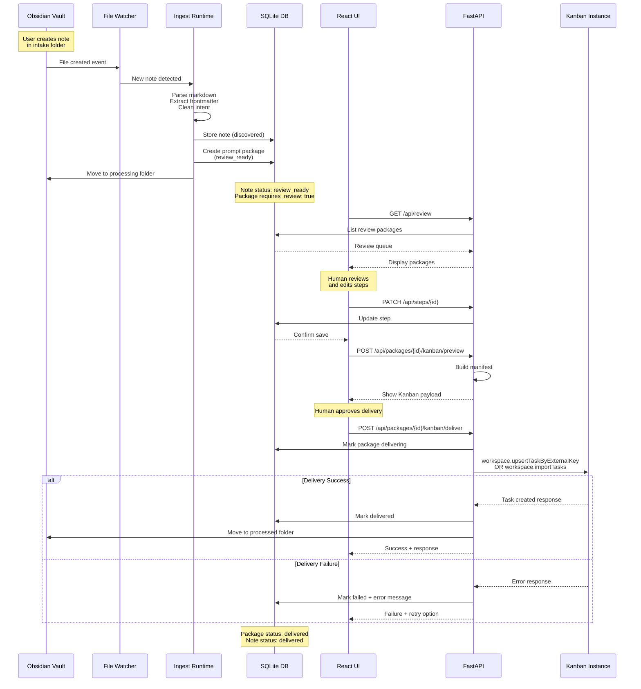

# Data Flow: Note to Kanban Task

## Flow Stages

### 1. Ingestion (Automatic)
- File watcher detects new note
- Markdown parsed, frontmatter extracted
- Intent cleaned and packaged
- Note moved to processing folder
- Status: `discovered` → `review_ready`

### 2. Review (Human-in-the-loop)
- Review queue populated
- Human edits prompt steps
- Preview Kanban payload
- Workspace selection

### 3. Approval (Manual Trigger)
- Package marked approved
- Note moved to processed folder
- Optional: Immediate delivery

### 4. Delivery (API-driven)
- Build Kanban manifest
- Capability detection (upsert vs import)
- Submit to Kanban instance
- Record response or error

### 5. Retry (Optional)
- Delivery failures can be retried
- Refreshes payload from current package state
- Re-attempts Kanban submission
