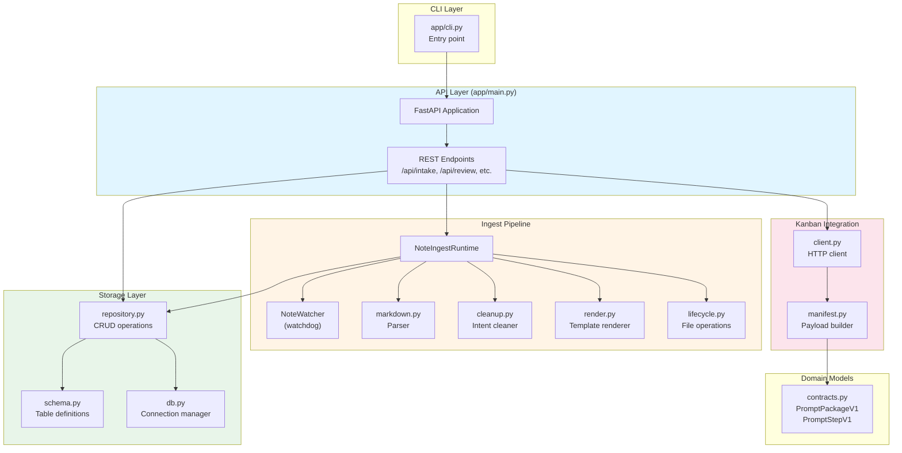
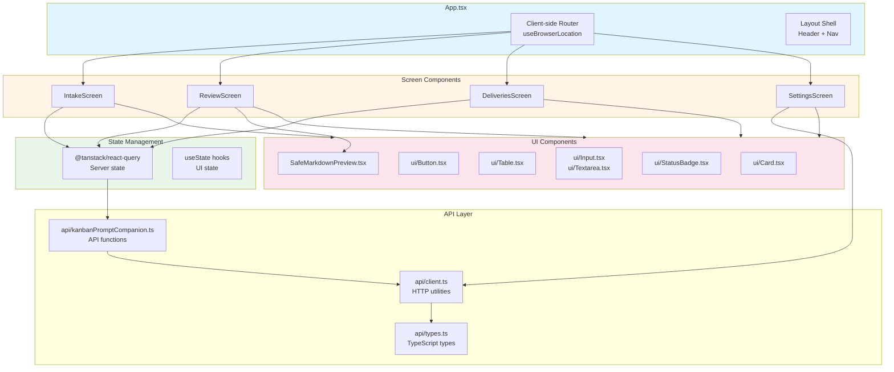

# Component Structure

## Backend Architecture

## Frontend Architecture

## Key Backend Modules

### app/main.py
- FastAPI application factory
- Route definitions
- Dependency injection (DB, Kanban client)

### app/ingest/
- **watcher.py**: File system monitoring
- **runtime.py**: Orchestrates ingestion pipeline
- **markdown.py**: Frontmatter + body parsing
- **cleanup.py**: Intent extraction and cleaning
- **render.py**: Jinja2 template rendering for prompts

### app/storage/
- **repository.py**: Database CRUD operations
- **schema.py**: SQLite table definitions
- **db.py**: Connection and initialization

### app/kanban/
- **client.py**: HTTP client with capability detection
- **manifest.py**: Converts PromptPackageV1 to Kanban format

## Key Frontend Modules

### src/App.tsx
- Single-page application shell
- Client-side routing
- Screen orchestration

### src/api/
- **kanbanPromptCompanion.ts**: Typed API functions
- **client.ts**: HTTP request utilities
- **types.ts**: TypeScript type definitions

### src/components/ui/
- Reusable UI primitives
- Consistent styling with Tailwind
