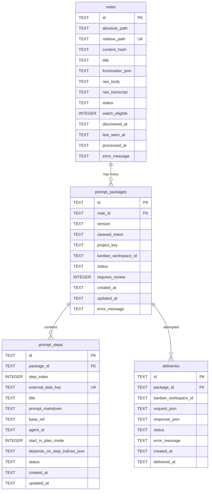

# Database Schema

## Table Details

### notes
Stores discovered markdown notes from the vault intake folder.

**Key Columns:**
- `id`: UUID primary key
- `relative_path`: Unique path within vault
- `content_hash`: SHA-256 of note content (deduplication)
- `status`: `discovered | skipped | parsed | generated | review_ready | delivered | failed | archived`
- `frontmatter_json`: YAML frontmatter serialized as JSON
- `raw_transcript`: Extracted transcript text (if present)

**Indexes:**
- `idx_notes_status`
- `idx_notes_content_hash`

### prompt_packages
Versioned prompt packages generated from notes.

**Key Columns:**
- `id`: UUID primary key
- `note_id`: Foreign key to notes
- `version`: Package schema version (currently "v1")
- `cleaned_intent`: Processed intent text ready for prompts
- `kanban_workspace_id`: Target workspace (can be null, falls back to config)
- `status`: `draft | review_ready | approved | delivering | delivered | failed | rejected`
- `requires_review`: Boolean flag for human review requirement

**Indexes:**
- `idx_prompt_packages_note_id`
- `idx_prompt_packages_status`

### prompt_steps
Individual prompt steps within a package.

**Key Columns:**
- `id`: UUID primary key
- `package_id`: Foreign key to prompt_packages
- `step_index`: Zero-based step order
- `external_task_key`: Unique task identifier for Kanban
- `prompt_markdown`: Editable prompt content
- `base_ref`: Git branch/ref for step execution
- `agent_id`: Target agent identifier
- `start_in_plan_mode`: Boolean flag
- `depends_on_step_indices_json`: Array of step dependencies
- `status`: `draft | approved | delivered | failed`

**Constraints:**
- Unique `(package_id, step_index)`
- Unique `external_task_key`

**Indexes:**
- `idx_prompt_steps_package_id`
- `idx_prompt_steps_status`

### deliveries
Delivery attempts to Kanban instance.

**Key Columns:**
- `id`: UUID primary key
- `package_id`: Foreign key to prompt_packages
- `kanban_workspace_id`: Target workspace at delivery time
- `request_json`: Full Kanban API request payload
- `response_json`: Kanban API response (null on failure)
- `status`: `previewed | delivering | delivered | failed | retry_ready`
- `error_message`: Failure reason
- `delivered_at`: Timestamp of successful delivery

**Indexes:**
- `idx_deliveries_package_id`
- `idx_deliveries_status`

## Relationships

- **notes → prompt_packages**: One-to-Many (a note can have multiple package versions)
- **prompt_packages → prompt_steps**: One-to-Many (a package contains multiple steps)
- **prompt_packages → deliveries**: One-to-Many (a package can have multiple delivery attempts)

## Cascade Behavior

All foreign keys use `ON DELETE CASCADE`:
- Deleting a note removes all its packages, steps, and deliveries
- Deleting a package removes all its steps and deliveries
