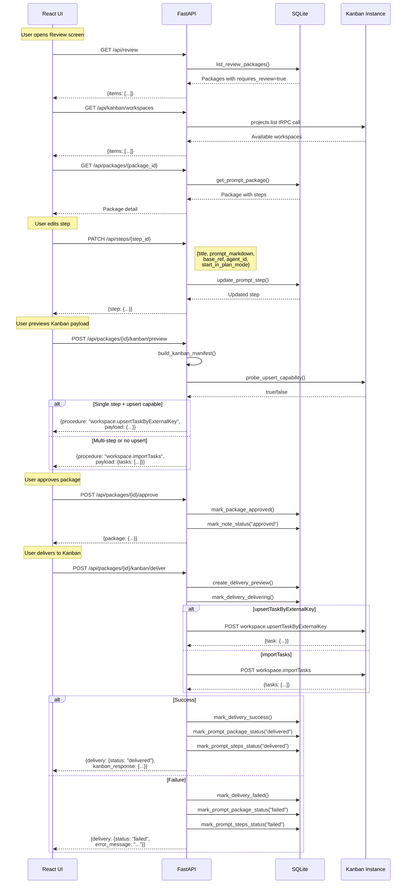
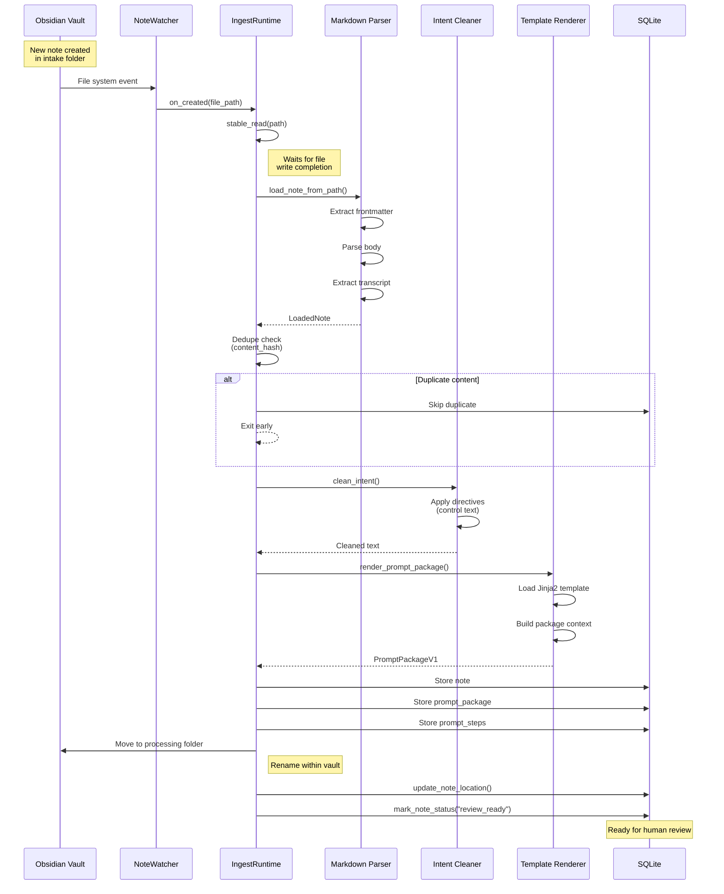
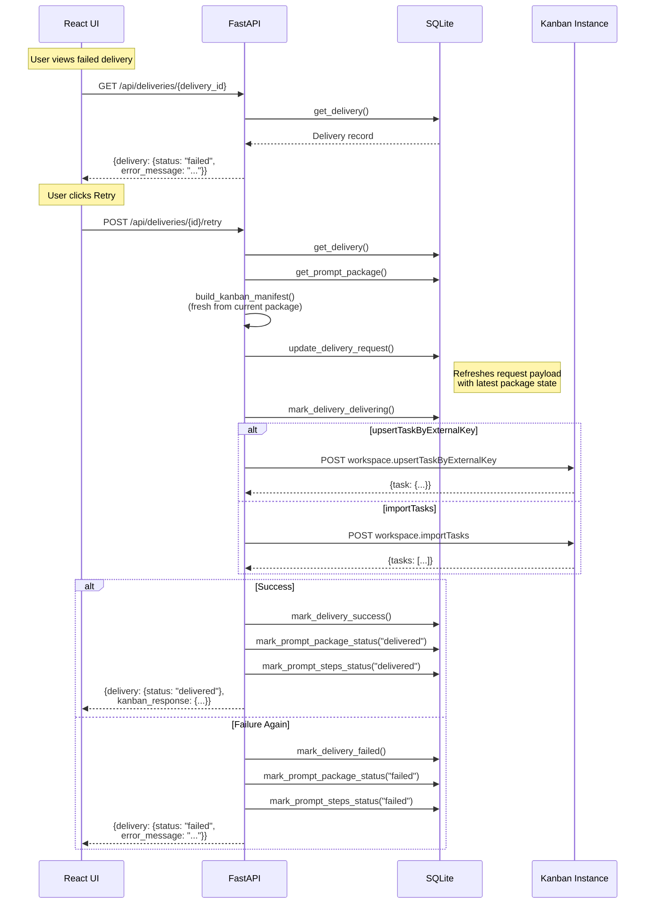

# API Flow Diagrams

## Review and Delivery Flow

## Intake Monitoring Flow

## Retry Delivery Flow

## Key API Endpoints

### Intake
- `GET /api/intake` - List notes with optional status filter
- `GET /api/intake/{note_id}` - Note detail with latest package

### Review
- `GET /api/review` - List packages requiring review
- `GET /api/packages/{package_id}` - Package detail with steps
- `PATCH /api/steps/{step_id}` - Update step fields
- `PATCH /api/packages/{package_id}` - Update workspace
- `POST /api/packages/{package_id}/approve` - Approve package

### Kanban Integration
- `GET /api/kanban/workspaces` - List Kanban workspaces
- `POST /api/packages/{id}/kanban/preview` - Preview payload
- `POST /api/packages/{id}/kanban/deliver` - Deliver to Kanban

### Deliveries
- `GET /api/deliveries` - List all delivery attempts
- `GET /api/deliveries/{delivery_id}` - Delivery detail
- `POST /api/deliveries/{delivery_id}/retry` - Retry failed delivery
