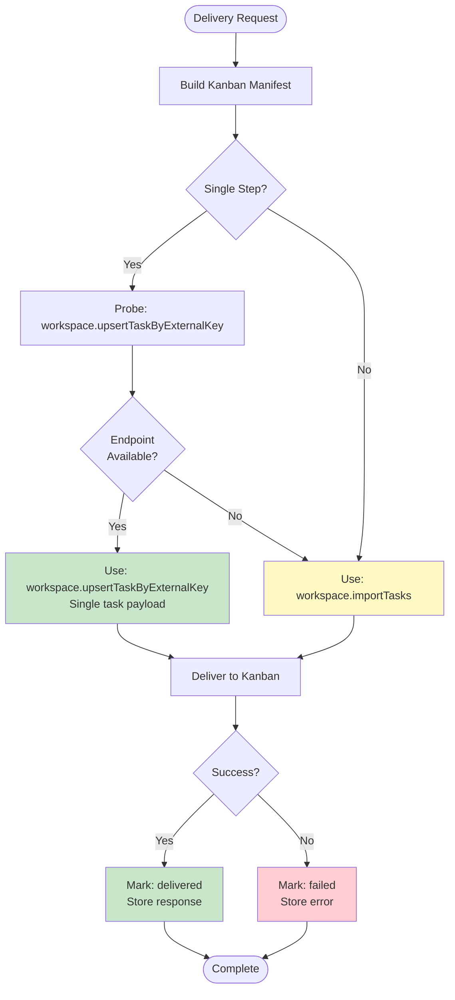
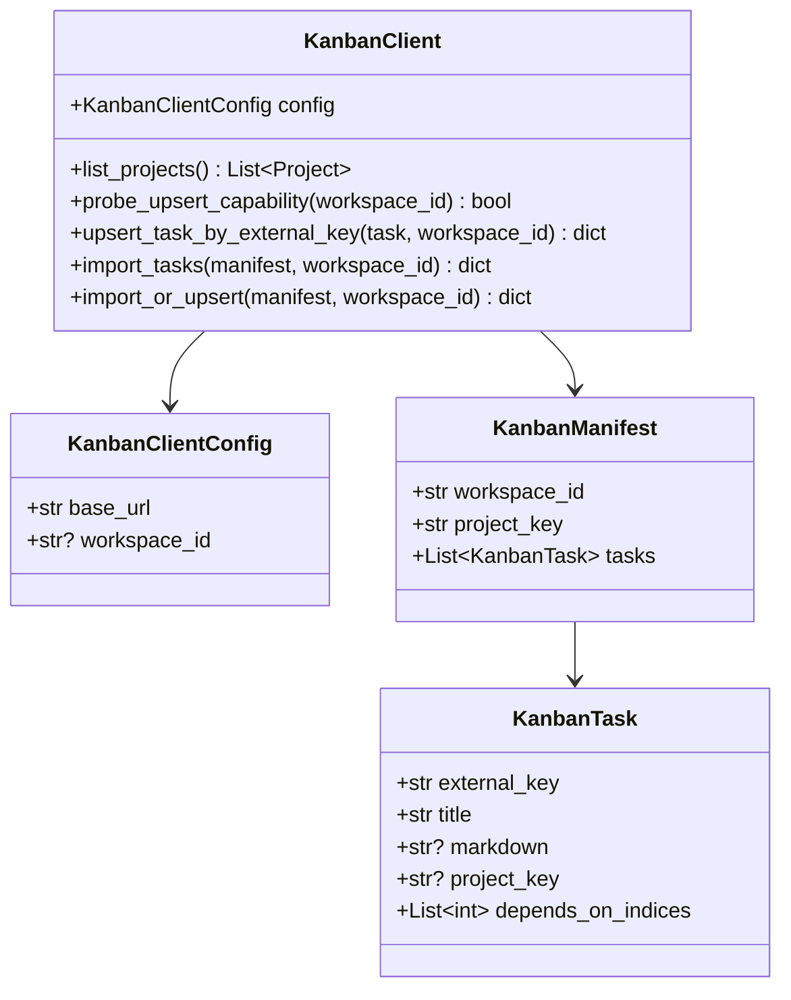
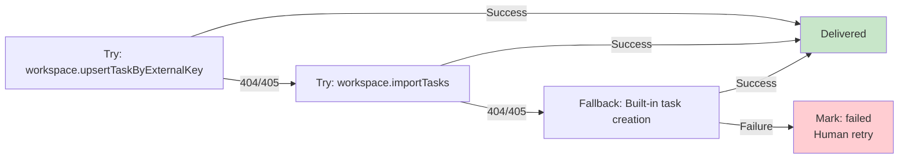

# Kanban Integration Architecture

## Capability Detection



## Kanban Client Capabilities



## Endpoint Selection Logic

```mermaid
flowchart TD
    Package[Prompt Package] --> CountSteps{Step Count}
    
    CountSteps -->|1 step| CheckUpsert[Check workspace.upsertTaskByExternalKey]
    CountSteps -->|Multiple steps| ImportTasks[Use workspace.importTasks]
    
    CheckUpsert --> ProbeCall[HTTP HEAD or OPTIONS request]
    
    ProbeCall --> UpsertExists{200 or 204<br/>response?}
    
    UpsertExists -->|Yes| UseUpsert[POST workspace.upsertTaskByExternalKey<br/><br/>Payload: Single task object<br/>{external_key, title, markdown, ...}]
    UpsertExists -->|No| ImportTasks
    
    ImportTasks --> UseImport[POST workspace.importTasks<br/><br/>Payload: Manifest object<br/>{workspace_id, project_key, tasks: [...]}]
    
    UseUpsert --> Response
    UseImport --> Response
    
    Response[Kanban Response] --> StoreResult[(Store in deliveries table)]
    
    style UseUpsert fill:#c8e6c9
    style UseImport fill:#fff9c4
    style StoreResult fill:#e1f5ff
```

## Supported Kanban Variants

### Stock Kanban
- Basic task creation via internal tRPC procedures
- No `workspace.importTasks` endpoint
- Fallback: Direct task creation through Kanban's built-in APIs

### Forked Kanban (Feature Branch)
- Extended endpoints: `workspace.importTasks`, `workspace.upsertTaskByExternalKey`
- Supports bulk task import with dependencies
- Single-task upsert by external key (idempotent)
- Project context and workspace routing

**Recommended Fork:**
`https://github.com/ngallodev-software/kanban/tree/fork/feature-requests/roll-up`

## Graceful Degradation



## Request/Response Examples

### upsertTaskByExternalKey Request
```json
{
  "external_key": "kpc-20260430-abc123-0",
  "title": "Implement feature X",
  "markdown": "## Context\n...",
  "project_key": "kanban",
  "depends_on_indices": []
}
```

### importTasks Request
```json
{
  "workspace_id": "workspace-uuid",
  "project_key": "kanban",
  "tasks": [
    {
      "external_key": "kpc-20260430-abc123-0",
      "title": "Step 1: Setup",
      "markdown": "...",
      "depends_on_indices": []
    },
    {
      "external_key": "kpc-20260430-abc123-1",
      "title": "Step 2: Implementation",
      "markdown": "...",
      "depends_on_indices": [0]
    }
  ]
}
```

### Success Response
```json
{
  "task": {
    "id": "task-uuid",
    "title": "Implement feature X",
    "status": "created"
  }
}
```

### Error Response
```json
{
  "error": "Workspace not found",
  "code": "WORKSPACE_NOT_FOUND"
}
```

## Error Handling Strategy

1. **Transport Errors** (network, timeout): `KanbanTransportError`
2. **Client Errors** (4xx, 5xx): `KanbanClientError`
3. **Capability Detection**: Probe before use, cache result
4. **Retry Logic**: Manual retry from Deliveries screen (not automatic)
5. **State Persistence**: All requests and responses stored in `deliveries` table
